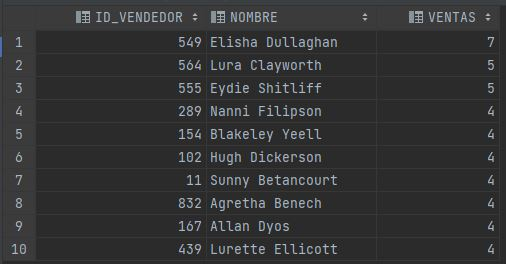
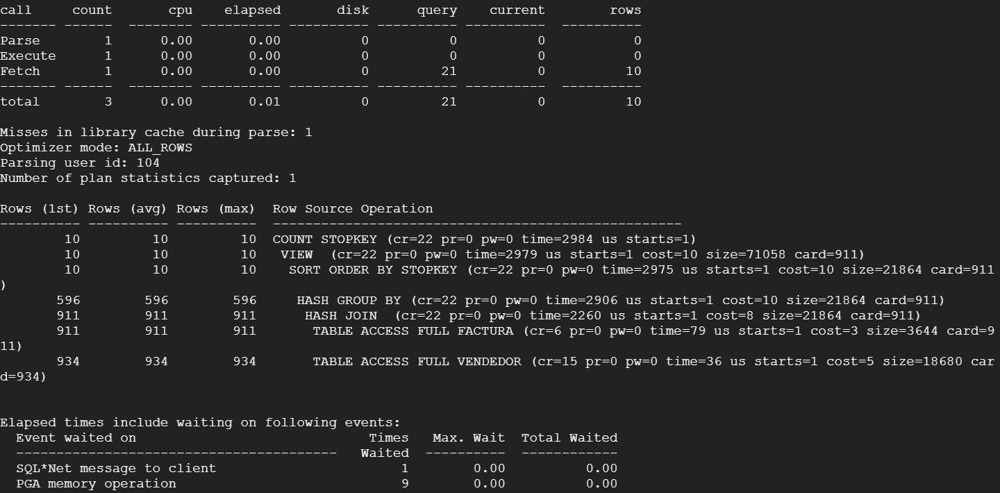
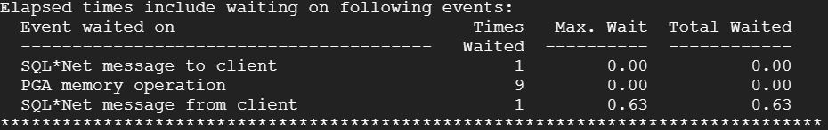
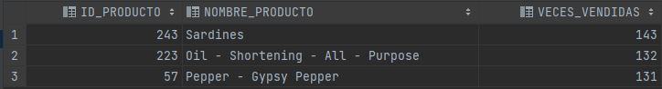
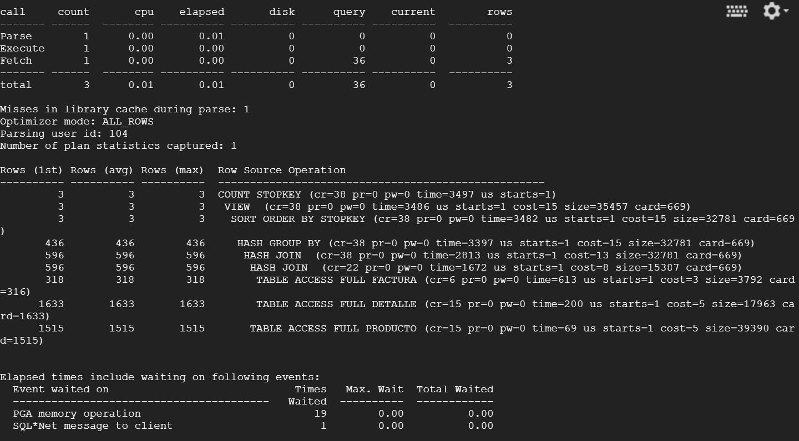
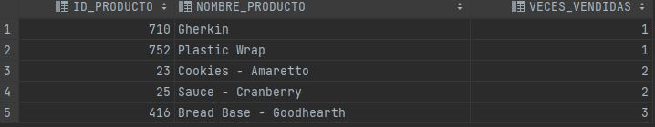
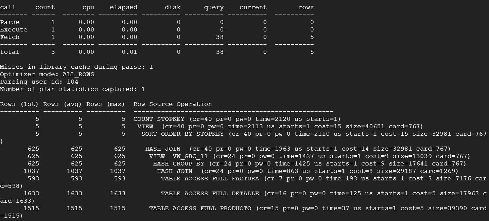
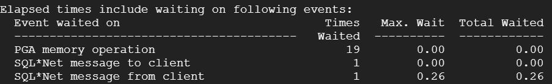
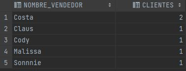
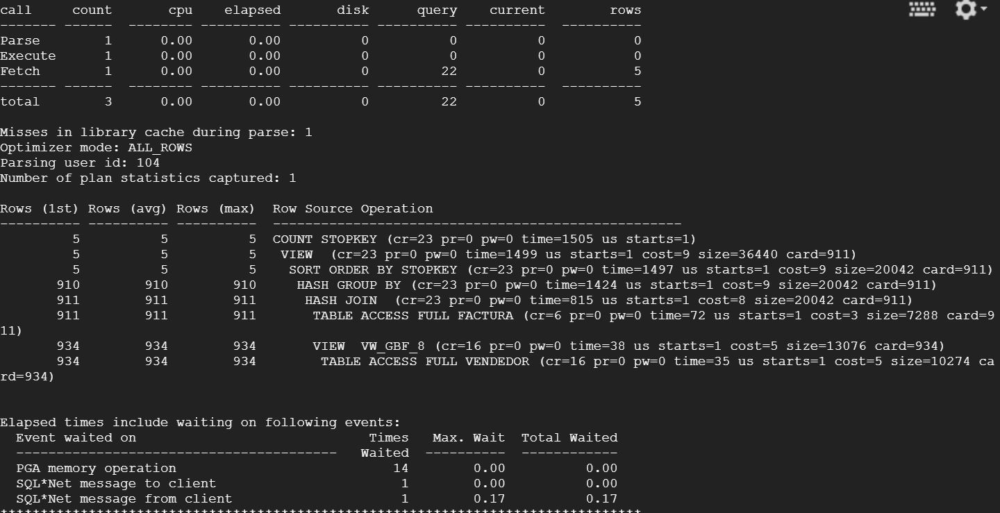

BD2_Practica2

##  Objetivos
Insertar datos de CSV a una base de datos de oracle, generar consultas y analizar rendimiendo de las mismas, comprender la utilización de los permisos de usuario dentro de la DBMS.

## Consulta 1

   ```sql
    			
       SELECT * FROM(
    SELECT
        Vendedor.id_vendedor,
        (nombre_vendedor || ' ' || apellido_vendedor) AS Nombre,
        COUNT(Vendedor.id_vendedor) AS Ventas
    FROM Vendedor
        INNER JOIN Factura
            ON Factura.id_vendedor = Vendedor.id_vendedor
    GROUP BY Vendedor.id_vendedor, (nombre_vendedor || ' ' || apellido_vendedor)
    ORDER BY Ventas DESC) WHERE ROWNUM <= 10;
 ```

#### Resultado 

</br></br>

#### Análisis plan de ejecución 

</br></br>




-   Podemos observar que el costo total de la consulta es de 46, siendo la parte del order by la más costosa en este aspecto, en tiempo total total transcurrido podemos observar que se obtiene un 0.01, la ejecución con mayor tiempo es la del order by, ya que tiene que ordenar todos los datos.


## Consulta 2
```sql
   SELECT * FROM (
    SELECT
        Producto.id_producto,
        nombre_producto,
        SUM(cantidad) AS Veces_Vendidas
    FROM Producto
        INNER JOIN Detalle
            ON Detalle.id_producto = Producto.id_producto
        INNER JOIN Factura
            ON Factura.id_factura = Detalle.id_factura
    WHERE
        Factura.fecha_factura >= TO_DATE('01/01/2020', 'dd/mm/yyyy') AND
        Factura.fecha_factura <= TO_DATE('31/12/2020', 'dd/mm/yyyy')
    GROUP BY Producto.id_producto, nombre_producto
    ORDER BY Veces_Vendidas DESC
) WHERE ROWNUM <= 3;
 ```

#### Resultado 

</br></br>

#### Análisis plan de ejecución

</br></br>


-   En este caso podemos observar el tiempo total utilizado por la cpu es de 0.01, teniendo un costo total de 79, siendo el mayor en costo y tiempo la instrucción order by, esta consulta contiene mayor costo, ya que tiene 2 validaciones boolenas, y un order by de más datos.

## Consulta 3
```sql
   SELECT * FROM (
    SELECT
        Producto.id_producto,
        nombre_producto,
        SUM(cantidad) AS Veces_Vendidas
    FROM Producto
        INNER JOIN Detalle
            ON Detalle.id_producto = Producto.id_producto
        INNER JOIN Factura
            ON Factura.id_factura = Detalle.id_factura
    WHERE
        Factura.fecha_factura >= TO_DATE('01/01/2020', 'dd/mm/yyyy') AND
        Factura.fecha_factura <= TO_DATE('31/12/2020', 'dd/mm/yyyy')
    GROUP BY Producto.id_producto, nombre_producto
    ORDER BY Veces_Vendidas DESC
) WHERE ROWNUM <= 3;
 ```

#### Resultado 

</br></br>

#### Análisis plan de ejecución

</br></br>




-   En esta consulta el tiempo total trancurrido podemos ver que es de 0.01,teniendo un coste total de 83, siendo la ejecución mas costosa el order by del final con un total de 15, esta es aún más elevada dado a que realiza un join y un group by.

## Consulta 4
```sql
   SELECT * FROM (
    SELECT
        Producto.id_producto,
        nombre_producto,
        SUM(cantidad) AS Veces_Vendidas
    FROM Producto
        INNER JOIN Detalle
            ON Detalle.id_producto = Producto.id_producto
        INNER JOIN Factura
            ON Factura.id_factura = Detalle.id_factura
    WHERE
        Factura.fecha_factura >= TO_DATE('01/01/2020', 'dd/mm/yyyy') AND
        Factura.fecha_factura <= TO_DATE('31/12/2020', 'dd/mm/yyyy')
    GROUP BY Producto.id_producto, nombre_producto
    ORDER BY Veces_Vendidas DESC
) WHERE ROWNUM <= 3;
 
```
#### Resultado 

</br></br>

#### Análisis plan de ejecución


-  Podemos observar que esta consulta es la menos costosa de las 4, teniendo un total de 43, siendo la operación más costosa el order by, con un total de 9 y un tiempo de ejecución de 1497


    