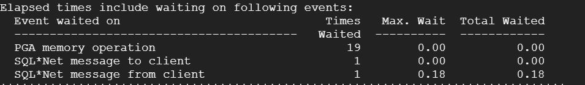

# BD2_Practica2

## Integrantes

- Kevin Estuardo Cardona Lopez 201800596
- Angel Manuel Miranda Asturias 201807394
- Christian Estuardo Mazariegos Rizo 201800580

## Objetivos

Insertar datos de CSV a una base de datos de oracle, generar consultas y analizar rendimiendo de las mismas, comprender la utilización de los permisos de usuario dentro de la DBMS.

## Consulta 1

```sql
    SELECT * FROM(
    SELECT
        Vendedor.id_vendedor,
        (nombre_vendedor || ' ' || apellido_vendedor) AS Nombre,
        COUNT(Vendedor.id_vendedor) AS Ventas
    FROM Vendedor
        INNER JOIN Factura
            ON Factura.id_vendedor = Vendedor.id_vendedor
    GROUP BY Vendedor.id_vendedor, (nombre_vendedor || ' ' || apellido_vendedor)
    ORDER BY Ventas DESC) WHERE ROWNUM <= 10;
 ```

### Resultado


</br></br>

### Análisis plan de ejecución


</br></br>


-   Podemos observar que el costo total de la consulta es de 46, siendo la parte del order by la más costosa en este aspecto, en tiempo total total transcurrido podemos observar que se obtiene un 0.01, la ejecución con mayor tiempo es la del order by, ya que tiene que ordenar todos los datos.


## Consulta 2

```sql
   SELECT * FROM (
    SELECT
        Producto.id_producto,
        nombre_producto,
        SUM(cantidad) AS Veces_Vendidas
    FROM Producto
        INNER JOIN Detalle
            ON Detalle.id_producto = Producto.id_producto
        INNER JOIN Factura
            ON Factura.id_factura = Detalle.id_factura
    WHERE
        Factura.fecha_factura >= TO_DATE('01/01/2020', 'dd/mm/yyyy') AND
        Factura.fecha_factura <= TO_DATE('31/12/2020', 'dd/mm/yyyy')
    GROUP BY Producto.id_producto, nombre_producto
    ORDER BY Veces_Vendidas DESC
) WHERE ROWNUM <= 3;
 ```

### Resultado 


</br></br>

### Análisis plan de ejecución


</br></br>



-   En este caso podemos observar el tiempo total utilizado por la cpu es de 0.01, teniendo un costo total de 79, siendo el mayor en costo y tiempo la instrucción order by, esta consulta contiene mayor costo, ya que tiene 2 validaciones boolenas, y un order by de más datos.

## Consulta 3

```sql
   SELECT * FROM (
    SELECT
        Producto.id_producto,
        nombre_producto,
        SUM(cantidad) AS Veces_Vendidas
    FROM Producto
        INNER JOIN Detalle
            ON Detalle.id_producto = Producto.id_producto
        INNER JOIN Factura
            ON Factura.id_factura = Detalle.id_factura
    WHERE
        Factura.fecha_factura >= TO_DATE('01/01/2020', 'dd/mm/yyyy') AND
        Factura.fecha_factura <= TO_DATE('31/12/2020', 'dd/mm/yyyy')
    GROUP BY Producto.id_producto, nombre_producto
    ORDER BY Veces_Vendidas DESC
) WHERE ROWNUM <= 3;
 ```

### Resultado 


</br></br>

### Análisis plan de ejecución


</br></br>


-   En esta consulta el tiempo total trancurrido podemos ver que es de 0.01,teniendo un coste total de 83, siendo la ejecución mas costosa el order by del final con un total de 15, esta es aún más elevada dado a que realiza un join y un group by.

## Consulta 4

```sql
   SELECT * FROM (
    SELECT
        Producto.id_producto,
        nombre_producto,
        SUM(cantidad) AS Veces_Vendidas
    FROM Producto
        INNER JOIN Detalle
            ON Detalle.id_producto = Producto.id_producto
        INNER JOIN Factura
            ON Factura.id_factura = Detalle.id_factura
    WHERE
        Factura.fecha_factura >= TO_DATE('01/01/2020', 'dd/mm/yyyy') AND
        Factura.fecha_factura <= TO_DATE('31/12/2020', 'dd/mm/yyyy')
    GROUP BY Producto.id_producto, nombre_producto
    ORDER BY Veces_Vendidas DESC
) WHERE ROWNUM <= 3;
 
```

### Resultado 


</br></br>

### Análisis plan de ejecución


- Podemos observar que esta consulta es la menos costosa de las 4, teniendo un total de 43, siendo la operación más costosa el order by, con un total de 9 y un tiempo de ejecución de 1497

## Asignaciones de roles y permisos

### 1. Alteracion de la session y creacion del tablespace

```sql
alter session set "_ORACLE_SCRIPT"=true;
CREATE TABLESPACE TSZAPATERIA DATAFILE 'ZAPATERIADF.tbs' SIZE 250M REUSE AUTOEXTEND ON NEXT 250K MAXSIZE 500M;
```

### 2. Creacion de roles

```sql
CREATE ROLES Contabilidad;
CREATE ROLES Ventas;
CREATE ROLES IT;
CREATE ROLES Gerencia;
```

### 3. Asignacion de permisos de a cada una de las tabas por cada uno de los roles

```sql
GRANT SELECT,INSERT ON ZAPATERIA.Cliente TO Contabilidad;
GRANT SELECT,INSERT ON ZAPATERIA.Cliente TO Ventas;
GRANT SELECT,DELETE ON ZAPATERIA.Cliente TO IT;
GRANT SELECT,INSERT,DELETE,UPDATE ON ZAPATERIA.Cliente TO Gerencia;

GRANT SELECT,INSERT ON ZAPATERIA.Vendedor TO Contabilidad;
GRANT SELECT,INSERT ON ZAPATERIA.Vendedor TO Ventas;
GRANT SELECT,DELETE ON ZAPATERIA.Vendedor TO IT;
GRANT SELECT,INSERT,DELETE,UPDATE ON ZAPATERIA.Vendedor TO Gerencia;

GRANT SELECT,INSERT ON ZAPATERIA.Producto TO Contabilidad;
GRANT SELECT,INSERT ON ZAPATERIA.Producto TO Ventas;
GRANT SELECT,DELETE ON ZAPATERIA.Producto TO IT;
GRANT SELECT,INSERT,DELETE,UPDATE ON ZAPATERIA.Producto TO Gerencia;

GRANT SELECT,INSERT ON ZAPATERIA.Factura TO Contabilidad;
GRANT SELECT,INSERT ON ZAPATERIA.Factura TO Ventas;
GRANT SELECT,DELETE ON ZAPATERIA.Factura TO IT;
GRANT SELECT,INSERT,DELETE,UPDATE ON ZAPATERIA.Factura TO Gerencia;

GRANT SELECT,INSERT ON ZAPATERIA.Detalle TO Contabilidad;
GRANT SELECT,INSERT ON lteIA.Detalle TO Ventas;
GRANT SELECT,DELETE ON ZAPATERIA.Detalle TO IT;
GRANT SELECT,INSERT,DELETE,UPDATE ON ZAPATERIA.Detalle TO Gerencia;
```

### 4. Asignacion de permisos diferentes a los roles IT y Gerencia.

```sql
GRANT CREATE USER, CREATE TABLE TO IT;
GRANT CREATE USER TO Gerencia;
```

### 5. Creacion de los usuarios con sus respectivas contraseñas asociandolos al tablespace

```sql
CREATE USER Contabilidad1 IDENTIFIED BY bd2Conta1 DEFAULT TABLESPACE TSZAPATERIA;
CREATE USER Contabilidad2 IDENTIFIED BY bd2Conta2 DEFAULT TABLESPACE TSZAPATERIA;
CREATE USER Ventas1 IDENTIFIED BY bd2Ventas1 DEFAULT TABLESPACE TSZAPATERIA;
CREATE USER Ventas2 IDENTIFIED BY bd2Ventas2 DEFAULT TABLESPACE TSZAPATERIA;
CREATE USER IT1 IDENTIFIED BY bd2IT1 DEFAULT TABLESPACE TSZAPATERIA;
CREATE USER IT2 IDENTIFIED BY IT2 DEFAULT TABLESPACE TSZAPATERIA;
CREATE USER Gerencia1 IDENTIFIED BY bd2Gerencia1 DEFAULT TABLESPACE TSZAPATERIA;
CREATE USER Gerencia2 IDENTIFIED BY bd2Gerencia2 DEFAULT TABLESPACE TSZAPATERIA; 
```

### 6. Proporcionar permisos de session a los usuarios

```sql
GRANT CREATE SESSION TO Contabilidad1;
GRANT CREATE SESSION TO Contabilidad2;
GRANT CREATE SESSION TO Ventas1;
GRANT CREATE SESSION TO Ventas2;
GRANT CREATE SESSION TO IT1;
GRANT CREATE SESSION TO IT2;
GRANT CREATE SESSION TO Gerencia1;
GRANT CREATE SESSION TO Gerencia2;
```

### 7.Finalmente se asocian los usuarios a los roles que se crearon anteriormente

```sql
GRANT Contabilidad TO Contabilidad1;
GRANT Ventas TO Ventas1;
GRANT IT TO IT1;
GRANT Gerencia TO Gerencia1;
GRANT Contabilidad TO Contabilidad2;
GRANT Ventas TO Ventas2 ; 
GRANT IT TO IT2;
GRANT Gerencia TO Gerencia2;
```
